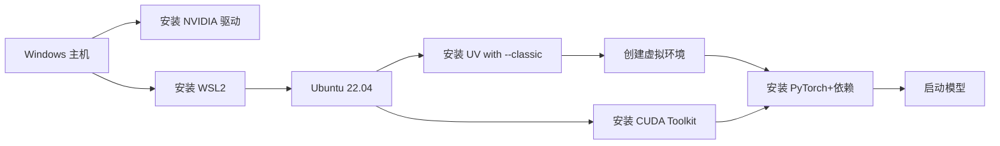

# doc2md
使用模型（docling 和 Nanonets-OCR-s）将PDF和图片的内容转换为markdown

## 下载模型
- [docling](https://www.modelscope.cn/models/ds4sd/docling-models)
- [Nanonets-OCR-s](https://www.modelscope.cn/models/nanonets/Nanonets-OCR-s)

```python
#模型下载
from modelscope import snapshot_download
model_dir = snapshot_download('nanonets/Nanonets-OCR-s', local_dir='./model')
print(model_dir)
```

## 在windows系统中部署模型
以下是在 Windows 系统中部署 AI 模型的详细步骤说明，结合了 WSL、UV 虚拟环境和 CUDA 的完整流程：

### **1. 安装 WSL（Windows Subsystem for Linux）**
**作用**：在 Windows 中创建 Linux 环境（推荐 Ubuntu），兼容 Linux 生态的模型部署工具。
```powershell
# 以管理员身份打开 PowerShell
wsl --install -d Ubuntu-22.04
```
- 安装后设置 Linux 用户名/密码
- 更新系统：
  ```bash
  sudo apt update && sudo apt upgrade -y
  ```


### **2. 使用 UV 创建 Python 虚拟环境**
**作用**：隔离项目依赖，避免包冲突。
```bash
# 在 WSL 的 Ubuntu 中操作
sudo snap install astral-uv --classic  # 需接受经典模式风险

# 创建虚拟环境（替换 myenv 为环境名）
uv venv myenv

# 激活环境
source myenv/bin/activate
```

### **3. 安装 CUDA 和 cuDNN**
**作用**：启用 GPU 加速（NVIDIA 显卡必需）。
#### 步骤：
1. **Windows 端**：
   - 安装最新 [NVIDIA 驱动](https://www.nvidia.com/Download/index.aspx)
   - 下载 [CUDA Toolkit](https://developer.nvidia.com/cuda-toolkit)（如 12.8）
   - 下载匹配的 [cuDNN](https://developer.nvidia.com/cudnn)（需注册账号）

2. **WSL 端**：
   ```bash
   # 安装 CUDA Toolkit (WSL 专用)
   wget https://developer.download.nvidia.com/compute/cuda/repos/wsl-ubuntu/x86_64/cuda-keyring_1.1-1_all.deb
   sudo dpkg -i cuda-keyring_1.1-1_all.deb
   sudo apt update
   sudo apt install cuda-12-8
   sudo apt install nvidia-cuda-toolkit

   # 验证安装
   nvcc --version  # 应显示 CUDA 版本
   nvidia-smi      # 查看 GPU 状态
   ```


### **4. 安装模型依赖并启动**
```bash
# 在激活的 UV 虚拟环境中操作
uv pip install torch torchvision --index-url https://download.pytorch.org/whl/cu121  # CUDA 12.1版本
uv pip install -r requirements.txt  # 安装模型特定依赖

# 启动模型（示例）
python launch.py \
  --model=meta-llama/Meta-Llama-3-8B-Instruct \
  --device=cuda  # 使用 GPU
```


### **关键问题解决方案**
1. **GPU 不可用检测**：
   ```python
   import torch
   print(torch.cuda.is_available())  # 应返回 True
   ```
   - 若为 `False`：
     - 检查 WSL 中 CUDA 版本：`nvcc --version`
     - 确保 PyTorch CUDA 版本匹配（如 `cu121`）

2. **经典模式风险说明**：
   - `astral-uv` 需要 `--classic` 因为它需访问系统级资源
   - 安全建议：仅从官方源（snapcraft.io）安装可信应用


### **完整工作流图示**


> **提示**：对于非 NVIDIA 显卡（AMD/Intel），可使用 ROCm 或 OpenVINO 替代 CUDA，具体参考硬件厂商文档。

## 在 linux 系统中部署模型
执行下面的命令
```shell
sh start_model.sh
```

## 部署后端
后端使用 python + fastapi 实现
### 后端环境准备
- 安装 uv 
    ```shell
    # 安装 uv
    curl -sSL https://astral.sh/uv/install.sh | sh

    # 验证 uv 安装成功
    uv --version
    # 0.1.1
    ```
- 设置 uv 国内下载源 （推荐）
    永久设置国内下载源（添加到 shell 配置文件如 ~/.bashrc 或 ~/.zshrc）：
    ```shell
    echo 'export UV_INDEX_URL=https://mirrors.aliyun.com/pypi/simple/' >> ~/.bashrc
    source ~/.bashrc

    # 查看设置的环境变量UV_INDEX_URL
    echo $UV_INDEX_URL
    # https://mirrors.aliyun.com/pypi/simple/
    ```
    单次安装时指定下载源：
    ```shell
    uv install fastapi -i https://mirrors.aliyun.com/pypi/simple/
    ```
- 使用 uv 创建虚拟环境，并指定 python 版本
    ```shell
    uv venv .venv --python 3.11
    ```
- 激活虚拟环境
    - Windows
    ```shell
    .venv\Scripts\activate.bat
    ```
    - macOS/Linux
    ```shell
    source .venv/bin/activate
    ```
### 启动后端项目
- 安装依赖
    ```shell
    uv sync
    ```
- 启动可编辑模式
    ```shell
    uv pip install -e .
    ```
- 启动后端项目
    ```shell
    uv run doc2md/main.py
    ```

## 部署前端

前端使用 Vite + React + TypeScript 实现
### 前端环境准备
- 下载 [nodejs](https://nodejs.org/en/download)
- 验证node安装成功 
```shell
node --version
# v22.18.0
npm --version
# 10.9.3
```
- npm 下载包切换国内镜像源

npm 下载包慢的主要原因是默认访问 国外服务器 导致的网络延迟，可通过切换国内镜像源解决。以下是具体方法：

永久切换 registry
```shell
# 设置淘宝镜像
npm config set registry https://registry.npmmirror.com

# 验证配置
npm config get registry
# 应返回 https://registry.npmmirror.com

```
### 启动前端
进入前端代码目录
```shell
cd frontend
```
安装依赖包
```shell
npm install
```
启动项目
```shell
npm run dev
```

访问 http://localhost:3000/

